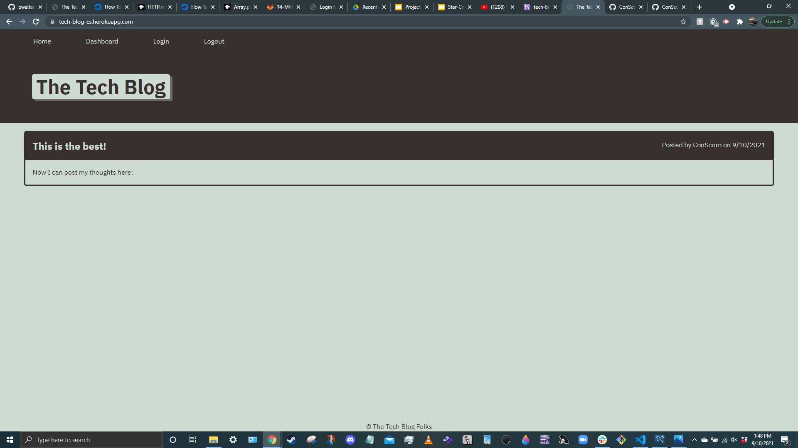
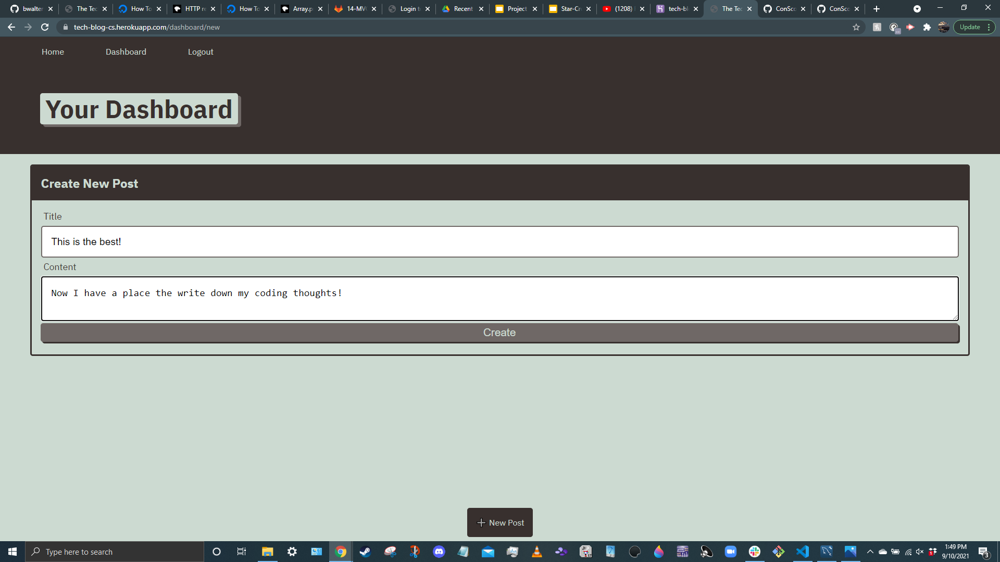

# README generator

## Description

This app is a blog, to be used by those in the tech industry. It allows a user to post their thoughts, update readers on current projects, or write tutorials for different coding practices. My motivation for building this project was to better understand the MVC file structure, and to learn how to implement a login/signup feature.

## Table of Contents

- [Installation](#installation)
- [Usage](#usage)
- [License](#license)
- [Questions](#questions)

## Installation

Here is the link to the Github repository: https://github.com/ConScorn/tech-blog
Here is the link to the deployed application: https://tech-blog-cs.herokuapp.com/

## Usage

To use the app, navigate to the deployed application, and click "Log In". From there, you can either sign up with a new account, or log in with an existing one. Then, click on "New Note" at the bottom of the screen to start blogging!

## License
MIT License

Copyright (c) [year] [fullname]

Permission is hereby granted, free of charge, to any person obtaining a copy
of this software and associated documentation files (the "Software"), to deal
in the Software without restriction, including without limitation the rights
to use, copy, modify, merge, publish, distribute, sublicense, and/or sell
copies of the Software, and to permit persons to whom the Software is
furnished to do so, subject to the following conditions:

The above copyright notice and this permission notice shall be included in all
copies or substantial portions of the Software.

THE SOFTWARE IS PROVIDED "AS IS", WITHOUT WARRANTY OF ANY KIND, EXPRESS OR
IMPLIED, INCLUDING BUT NOT LIMITED TO THE WARRANTIES OF MERCHANTABILITY,
FITNESS FOR A PARTICULAR PURPOSE AND NONINFRINGEMENT. IN NO EVENT SHALL THE
AUTHORS OR COPYRIGHT HOLDERS BE LIABLE FOR ANY CLAIM, DAMAGES OR OTHER
LIABILITY, WHETHER IN AN ACTION OF CONTRACT, TORT OR OTHERWISE, ARISING FROM,
OUT OF OR IN CONNECTION WITH THE SOFTWARE OR THE USE OR OTHER DEALINGS IN THE
SOFTWARE.

## Questions
Here is a link to my GitHub profile: https://github.com/ConScorn. Otherwise, you can email me at: connorscorn@hotmail.com
